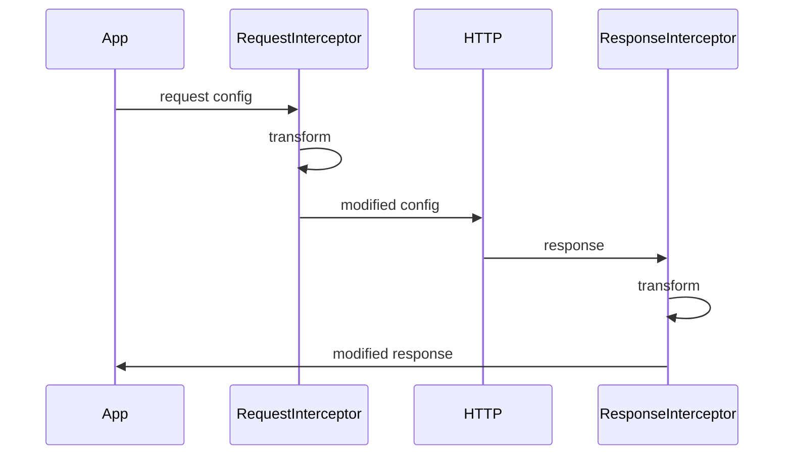

# Conceptos Clave

Esta página cubre los conceptos fundamentales que debes entender para trabajar eficientemente con Better Call.

## Arquitectura del Paquete

Better Call está diseñado con una arquitectura modular que separa responsabilidades:

```mermaid
graph TB
    A[@api-zero/core] --> B[ApiClient]
    A --> C[ApiError]
    A --> D[InterceptorManager]
    A --> E[Retry System]
    A --> F[Params Serializer]
    
    G[@api-zero/react] --> H[ApiProvider]
    G --> I[useApi Hook]
    G --> J[React Context]
    
    G -.depends on.-> A
    
    style A fill:#3b82f6
    style G fill:#8b5cf6
```

### @api-zero/core

El paquete **core** es completamente independiente de React y proporciona:

- Cliente HTTP basado en `fetch` nativo
- Sistema de configuración flexible
- Manejo avanzado de errores
- Interceptores para requests y responses
- Sistema de reintentos con backoff
- Serialización de query parameters
- Progress tracking para uploads/downloads

### @api-zero/react

El paquete **React** depende del core y añade:

- Provider para compartir configuración globalmente
- Hook `useApi` para acceder al cliente
- Integración perfecta con el ciclo de vida de React

<Callout type="info">
Puedes usar `@api-zero/core` sin React en cualquier proyecto JavaScript/TypeScript. El paquete `@api-zero/react` es opcional y solo necesario si trabajas con React.
</Callout>

## Cliente HTTP vs Provider React

Hay dos formas principales de usar Better Call, cada una con sus ventajas:

### 1. Cliente Standalone

Creas instancias del cliente manualmente usando `createClient`:

```typescript
import { createClient } from '@api-zero/core';

const apiClient = createClient({
  baseURL: 'https://api.example.com',
  timeout: 5000,
});

// Úsalo directamente
const users = await apiClient.get('/users');
```

**Ventajas:**
- ✅ Control total sobre cada instancia
- ✅ Múltiples clientes con diferentes configuraciones
- ✅ No requiere React
- ✅ Útil para casos específicos (ej: diferentes APIs)

**Cuándo usarlo:**
- Proyectos sin React
- Necesitas múltiples clientes con configuraciones distintas
- Prefieres control explícito sobre instancias

### 2. React Provider

Usas el `ApiProvider` para compartir el cliente globalmente:

```typescript
import { ApiProvider, useApi } from '@api-zero/react';

// En el root de tu app
function App() {
  return (
    <ApiProvider config={{ baseURL: 'https://api.example.com' }}>
      <UserList />
    </ApiProvider>
  );
}

// En cualquier componente hijo
function UserList() {
  const client = useApi();
  const users = await client.get('/users');
}
```

**Ventajas:**
- ✅ Configuración centralizada
- ✅ No necesitas pasar el cliente como prop
- ✅ Un solo cliente compartido en toda la app
- ✅ Integración natural con React

**Cuándo usarlo:**
- Proyectos React
- Una sola API o configuración común
- Prefieres el patrón Context de React

<Callout type="success">
En aplicaciones React, **recomendamos usar el Provider** para la mayoría de casos. Solo crea instancias standalone cuando necesites configuraciones muy específicas.
</Callout>

## Configuración Global vs Por-Request

Better Call permite configuración en dos niveles:

### Configuración Global

Se define al crear el cliente y aplica a todas las peticiones:

```typescript
const client = createClient({
  baseURL: 'https://api.example.com',
  timeout: 5000,
  headers: {
    'X-App-Version': '1.0.0',
  },
  retry: {
    attempts: 3,
    delay: 1000,
    backoff: 'exponential',
  },
});
```

### Configuración Por-Request

Se define en cada petición y sobrescribe la global:

```typescript
// Esta petición tiene timeout de 10s (sobrescribe el global de 5s)
const users = await client.get('/users', {
  timeout: 10000,
  headers: {
    'X-Custom-Header': 'value', // Se combina con headers globales
  },
});
```

<Callout type="info">
Las opciones por-request se **combinan** con las globales. Los headers se mergean, mientras que opciones como `timeout` sobrescriben el valor global.
</Callout>

## Sistema de Interceptores

Los interceptores permiten interceptar y transformar requests o responses antes de que se procesen:



### Request Interceptors

Se ejecutan **antes** de enviar la petición:

```typescript
client.interceptors.request.use(
  (config) => {
    // Añadir token de autenticación
    const token = localStorage.getItem('token');
    if (token) {
      config.headers = {
        ...config.headers,
        Authorization: `Bearer ${token}`,
      };
    }
    return config;
  },
  (error) => {
    // Manejar errores durante la preparación
    return Promise.reject(error);
  }
);
```

### Response Interceptors

Se ejecutan **después** de recibir la respuesta:

```typescript
client.interceptors.response.use(
  (response) => {
    // La respuesta es exitosa (2xx)
    return response;
  },
  async (error) => {
    // La respuesta es un error (4xx, 5xx)
    if (error.status === 401) {
      await refreshToken();
      // Reintentar la petición original
    }
    return Promise.reject(error);
  }
);
```

**Casos de uso comunes:**
- 🔐 Añadir tokens de autenticación automáticamente
- 🔄 Refresh de tokens cuando expiran
- 📊 Logging de requests/responses
- 🔀 Transformar datos (ej: snake_case → camelCase)
- ⚠️ Manejo centralizado de errores

## Sistema de Reintentos

Better Call incluye un sistema de retry configurable que reintenta automáticamente peticiones fallidas:

### Configuración Básica

```typescript
const client = createClient({
  retry: {
    attempts: 3,        // Número de reintentos
    delay: 1000,        // Delay base en ms
    backoff: 'exponential', // Estrategia de backoff
  },
});
```

### Estrategias de Backoff

#### Exponencial (recomendado)

El delay se duplica en cada intento:

```typescript
retry: {
  attempts: 4,
  delay: 1000,
  backoff: 'exponential',
}
// Delays: 1s, 2s, 4s, 8s
```

#### Lineal

El delay aumenta linealmente:

```typescript
retry: {
  attempts: 4,
  delay: 1000,
  backoff: 'linear',
}
// Delays: 1s, 2s, 3s, 4s
```

#### Personalizado

Define tu propia función de backoff:

```typescript
retry: {
  attempts: 3,
  delay: 1000,
  backoff: (attempt) => {
    // Backoff aleatorio entre 1s y 3s
    return 1000 + Math.random() * 2000;
  },
}
```

### Condiciones de Reintento

Por defecto, Better Call reintenta **todos los errores**. Puedes personalizar esto:

```typescript
retry: {
  attempts: 3,
  delay: 1000,
  retryCondition: (error) => {
    // Solo reintentar errores de red o 5xx
    return error.isNetworkError || error.is5xx();
  },
}
```

<Callout type="warning">
Ten cuidado con los reintentos en peticiones **no idempotentes** (POST, PUT, PATCH). Podrías crear recursos duplicados o modificar datos múltiples veces.
</Callout>

## Manejo de Errores

api-zero usa una clase de error personalizada que proporciona información detallada:

```typescript
import { ApiError } from '@api-zero/core';

try {
  await client.get('/users');
} catch (error) {
  if (error instanceof ApiError) {
    console.log(error.status);        // 404
    console.log(error.statusText);    // "Not Found"
    console.log(error.data);          // Response body
    console.log(error.isTimeout);     // false
    console.log(error.isNetworkError); // false
    
    // Helper methods
    if (error.is4xx()) {
      // Error del cliente
    }
    if (error.isUnauthorized()) {
      // Redirect a login
    }
  }
}
```

**Propiedades útiles:**
- `status`: Código HTTP (404, 500, etc.)
- `statusText`: Texto del status
- `data`: Body de la respuesta de error
- `config`: Configuración de la petición que falló
- `isTimeout`: `true` si fue un timeout
- `isNetworkError`: `true` si fue un error de red
- `isAborted`: `true` si se canceló la petición

**Métodos helper:**
- `is4xx()`: Errores del cliente (400-499)
- `is5xx()`: Errores del servidor (500-599)
- `isUnauthorized()`: Error 401
- `isForbidden()`: Error 403
- `isNotFound()`: Error 404

## Serialización de Query Parameters

Better Call serializa automáticamente los parámetros de query con soporte para arrays:

```typescript
// Arrays con formato brackets (default)
await client.get('/users', {
  params: { ids: [1, 2, 3] },
  paramsSerializer: { arrayFormat: 'brackets' },
});
// URL: /users?ids[]=1&ids[]=2&ids[]=3

// Arrays con formato repeat
await client.get('/users', {
  params: { ids: [1, 2, 3] },
  paramsSerializer: { arrayFormat: 'repeat' },
});
// URL: /users?ids=1&ids=2&ids=3

// Arrays con formato comma
await client.get('/users', {
  params: { ids: [1, 2, 3] },
  paramsSerializer: { arrayFormat: 'comma' },
});
// URL: /users?ids=1,2,3
```

Los valores `null` y `undefined` se ignoran automáticamente:

```typescript
await client.get('/users', {
  params: {
    name: 'John',
    age: undefined,  // Se ignora
    city: null,      // Se ignora
  },
});
// URL: /users?name=John
```

## Próximos Pasos

<Cards>
  <Card 
    title="Guía Rápida" 
    href="/docs/getting-started"
    description="Crea tu primera petición en 5 minutos"
  />
  <Card 
    title="API Reference" 
    href="/docs/api/core/client"
    description="Documentación completa de todas las APIs"
  />
  <Card 
    title="Guías Avanzadas" 
    href="/docs/guides/authentication"
    description="Patrones avanzados y mejores prácticas"
  />
</Cards>
