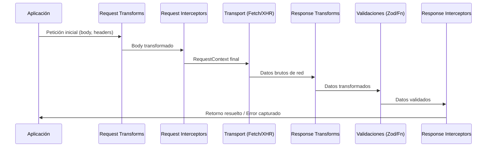

Esta página cubre los conceptos fundamentales que debes entender para trabajar eficientemente con api-zero.

## Arquitectura del Ecosistema

api-zero está diseñado con una arquitectura modular y desacoplada en tres paquetes:

```mermaid
graph TB
    A[@api-zero/core] --> B[ApiClient]
    A --> C[ApiError]
    A --> D[InterceptorManager]
    A --> E[Retry Engine]
    A --> F[Transportes: Fetch & XHR]
    A --> G[Params Serializer]
    
    H[@api-zero/react] --> I[ApiProvider]
    H --> J[useRequest]
    H --> K[useMutation]
    H --> L[useApi]
    H -.depends on.-> A

    M[@api-zero/zod] --> N[zodResponse]
    M --> O[zodBody]
    M --> P[ZodApiClient]
    M --> Q[defineContract]
    M -.depends on.-> A

    style A fill:#3b82f6,stroke:#2563eb,color:#fff
    style H fill:#8b5cf6,stroke:#7c3aed,color:#fff
    style M fill:#10b981,stroke:#059669,color:#fff
```

### 1. @api-zero/core
El paquete **core** es agnóstico al framework y funciona en cualquier runtime moderno (Browser, Node 22+, Edge):
- Cliente HTTP modular basado en pipeline determinista.
- Capa de transporte extraíble (`FetchTransport` por defecto, `XhrTransport` para seguimiento de progreso).
- Manejo estructurado de errores con `ApiError`.
- Interceptores asíncronos para requests y responses con soporte de recuperación (refresh token).
- Motor de reintentos con backoff exponencial/lineal, jitter, límites de delay y respeto de `Retry-After`.
- Serializador configurable de query parameters.

### 2. @api-zero/react
Bindings de primer nivel para React 18 y 19:
- `ApiProvider` con memoización estructuralmente estable de clientes.
- `useRequest`: hook declarativo con cancelación automática por `AbortController` al desmontar.
- `useMutation`: hook de mutaciones con soporte síncrono y asíncrono (`mutate` / `mutateAsync`) y callbacks de ciclo de vida.
- `useApi`: acceso directo a la instancia de cliente activa.

### 3. @api-zero/zod
Validación y contratos en tiempo de ejecución:
- `zodResponse`: inferencia estática de tipo de retorno y transformación segura (`safeParseAsync`).
- `zodBody`: validación fail-fast antes de enviar peticiones a la red.
- `ZodApiClient`: wrapper fluido con métodos directos tipados (`api.get(url, schema)`).
- `defineContract`: definición de endpoints reutilizables y fuertemente tipados.

---

## Pipeline Determinista de Ejecución

Cada petición procesada por `ApiClient` sigue un flujo riguroso y determinista:



1. **Request Transforms**: Globales primero, luego por-petición (soporta funciones asíncronas y `zodBody`).
2. **Request Interceptors**: Enriquecimiento de cabeceras, tokens o modificación de contexto.
3. **Transporte & Reintentos**: Envío a través de `FetchTransport` (o `XhrTransport`) envuelto por el motor inteligente de reintentos (`withRetry`).
4. **Response Transforms**: Globales primero, luego por-petición (soporta `zodResponse`).
5. **Validación**: Comprobación de respuesta (`validateResponse` o Zod schemas).
6. **Response Interceptors**: Interceptores de éxito (`fulfilled`) o de error (`rejected`) con capacidad de recuperar la petición (ej: refrescar token 401 y reintentar).

---

## Sistema Inteligente de Reintentos

A diferencia de clientes básicos que reintentan cualquier error o ninguno, api-zero implementa una política inteligente de nivel de producción:

- **Elegibilidad por Error**: Reintenta automáticamente fallos de red (`isNetworkError`), timeouts (`isTimeout` / `408`), rate limits (`429`) y errores de servidor (`500..599`). Bloquea reintentos ante cancelaciones del usuario (`isAborted`), errores de validación (`isValidationError`) y errores 4xx del cliente.
- **Elegibilidad por Método**: Métodos seguros e idempotentes (`GET`, `PUT`, `DELETE`) reintentan automáticamente; métodos no idempotentes (`POST`, `PATCH`) no reintentan por defecto para evitar duplicaciones, salvo que se active `retryUnsafeMethods: true`.
- **Jitter y Cap**: Aplica variación aleatoria (*equal jitter*) para evitar avalanchas de tráfico (*thundering herd*) y respeta un límite superior `maxDelay` (30s por defecto).
- **Cabecera Retry-After**: Respeta automáticamente las cabeceras `Retry-After` enviadas por servidores en respuestas 429 y 503.
- **Cancelación Inmediata**: Si la petición es abortada durante la pausa entre reintentos, el temporizador se limpia instantáneamente sin bloquear la ejecución.

---

## Siguiente Nivel

<Cards>
  <Card 
    title="Guía Rápida" 
    href="/docs/core/getting-started"
    description="Crea tu primera petición en 5 minutos"
  />
  <Card 
    title="API Reference" 
    href="/docs/core/api-reference/client"
    description="Documentación completa de ApiClient y createClient"
  />
  <Card 
    title="Validación con Zod" 
    href="/docs/zod"
    description="Aprende a usar @api-zero/zod"
  />
  <Card 
    title="Hooks de React" 
    href="/docs/react"
    description="Guía completa de useRequest y useMutation"
  />
</Cards>
